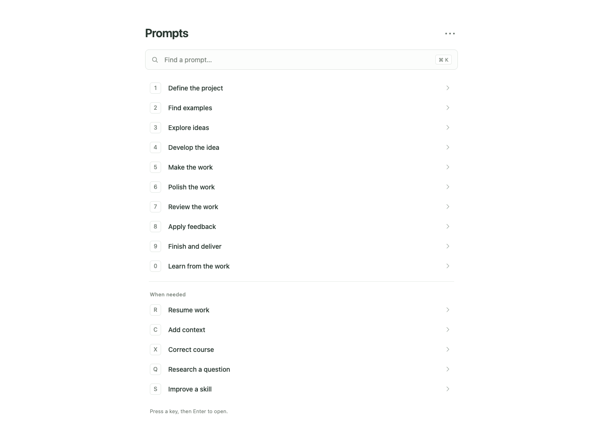
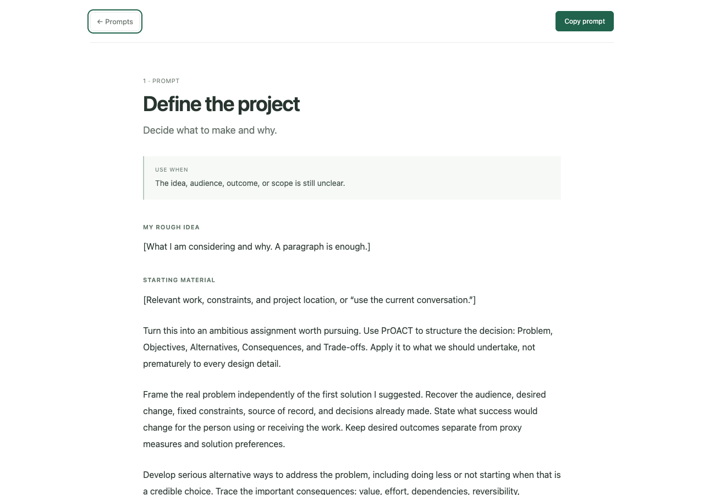

# Veto Prompts

A small, keyboard-first prompt library for substantial AI work.



## What this is

Veto Prompts is the prompt set and local frontend we use to move through a project: define it, find examples, explore ideas, develop the strongest direction, make the work, polish it, review it, apply feedback, finish it, and learn from the result.

The public repository contains the prompt text and the frontend. It intentionally does **not** contain private review history, local databases, access tokens, internal files, or personal working notes.

## Use it

Run:

```bash
python3 server.py
```

Then open `http://localhost:8926/`.
The keyboard flow is deliberately simple:

- Press **1–9** or **0** to copy a main prompt immediately.
- Press **R / C / X / Q / S** to copy the situational prompts immediately.
- Press **B** to copy “Write a feature spec” under **Building Stuff**.
- Press **Enter** to open the prompt you just copied.
- Press **⌘K** / **Ctrl-K** to search.
- In the prompt reader, click **Copy prompt** or press **⌘Enter** / **Ctrl-Enter**.
- Press **Escape** to return to the library.

Each prompt has one canonical version. There are no hidden short/deep/full variants.

## The prompts

| Key | Prompt |
| --- | --- |
| 1 | Define the project |
| 2 | Find examples |
| 3 | Explore ideas |
| 4 | Develop the idea |
| 5 | Make the work |
| 6 | Polish the work |
| 7 | Review the work |
| 8 | Apply feedback |
| 9 | Finish and deliver |
| 0 | Learn from the work |
Situational prompts:

| Key | Prompt |
| --- | --- |
| R | Resume work |
| C | Add context |
| X | Correct course |
| Q | Research a question |
| S | Improve a skill |

The full text is in [PROMPTS.md](PROMPTS.md) and [prompts.json](prompts.json).

## Frontend

The UI is plain HTML, CSS, and JavaScript. There is no build step and no framework dependency. `server.py` is only a tiny local static server with SPA fallback for `/prompt/<id>` routes.



## License

MIT. See [LICENSE](LICENSE).
